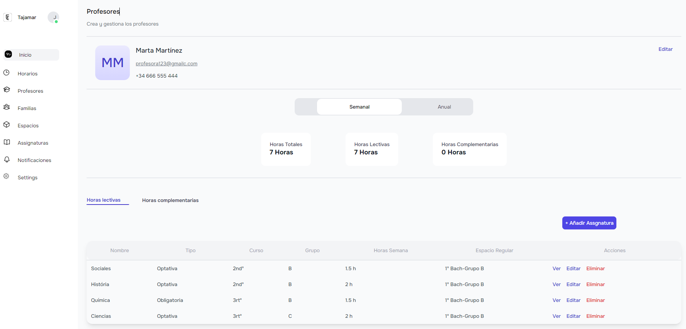

# Dashboard de Profesores - Proyecto Full Stack
Este proyecto es un dashboard de profesores desarrollado como una aplicación full stack, lo que significa que abarca tanto el desarrollo del frontend como del backend. Utiliza un conjunto de tecnologías modernas para ofrecer una experiencia óptima para los usuarios y facilitar el desarrollo y mantenimiento del proyecto.

## Tecnologías Utilizadas
### Frontend:
- Next.js: Next.js es un framework de React que proporciona renderización del lado del servidor, enrutamiento sencillo y una estructura modular para el desarrollo de aplicaciones web. Con Next.js, podemos crear páginas estáticas o dinámicas de manera eficiente, lo que resulta ideal para construir interfaces de usuario interactivas como un dashboard.
- TypeScript: TypeScript añade tipado estático opcional a JavaScript, lo que ayuda a detectar errores de manera temprana y a mejorar la robustez del código. En un proyecto de tamaño mediano a grande como este, TypeScript se vuelve especialmente valioso al facilitar el mantenimiento del código y la colaboración entre desarrolladores.
- Tailwind CSS: Tailwind CSS es un framework de CSS utilitario que permite diseñar rápidamente interfaces de usuario con clases predefinidas. Al utilizar Tailwind CSS, podemos crear estilos coherentes y personalizables de manera eficiente, lo que acelera el desarrollo y garantiza una apariencia consistente en toda la aplicación.
### Backend:
- MongoDB: MongoDB es una base de datos NoSQL que ofrece flexibilidad y escalabilidad para aplicaciones web modernas. Utilizamos MongoDB para almacenar y gestionar los datos relacionados con los profesores, asignaturas y horarios en este proyecto. Su esquema flexible permite adaptarse fácilmente a cambios en los requisitos de la aplicación, lo que resulta ideal para un proyecto en constante evolución como este.
### Ventajas de las Tecnologías Utilizadas
- Next.js: La combinación de renderización del lado del servidor y enrutamiento sencillo de Next.js proporciona una experiencia de usuario rápida y fluida. Además, su estructura modular facilita la organización del código y la escalabilidad de la aplicación.
- TypeScript: TypeScript ayuda a detectar errores de manera temprana y a mejorar la calidad del código, lo que resulta en una aplicación más robusta y fácil de mantener. Su sistema de tipos estáticos también mejora la productividad del desarrollador al proporcionar autocompletado y documentación en tiempo real.
- Tailwind CSS: Tailwind CSS permite diseñar interfaces de usuario personalizables y coherentes con facilidad. Sus clases utilitarias predefinidas simplifican el proceso de estilización y garantizan una apariencia consistente en toda la aplicación.
- MongoDB: La flexibilidad y escalabilidad de MongoDB lo hacen ideal para aplicaciones web en crecimiento. Su esquema flexible permite adaptarse fácilmente a cambios en los requisitos de la aplicación, lo que facilita el desarrollo y la evolución del proyecto a lo largo del tiempo.
Con la combinación de estas tecnologías, hemos creado un dashboard de profesores eficiente, escalable y fácil de mantener. ¡Esperamos que disfrutes utilizando esta aplicación! Si tienes alguna pregunta o sugerencia, no dudes en ponerte en contacto con nosotros. ¡Gracias por tu interés en nuestro proyecto!

## Clonar y Ejecutar
Para clonar y ejecutar este proyecto en tu máquina local, sigue estos pasos:

1. Clona el repositorio desde GitHub:

git clone https://https://github.com/Naidev7/Teacher-dashboard.git

2. Navega hasta el directorio del proyecto:

cd dashboard-profesores

3. Instala las dependencias:

npm install

4. Inicia la aplicación:

npm run dev

5. Abre tu navegador y accede a http://localhost:3000 para ver la aplicación en funcionamiento.

¡Disfruta utilizando el dashboard de profesores! Si tienes alguna pregunta o necesitas ayuda adicional, no dudes en ponerte en contacto con nosotros. ¡Gracias por tu interés en nuestro proyecto!
